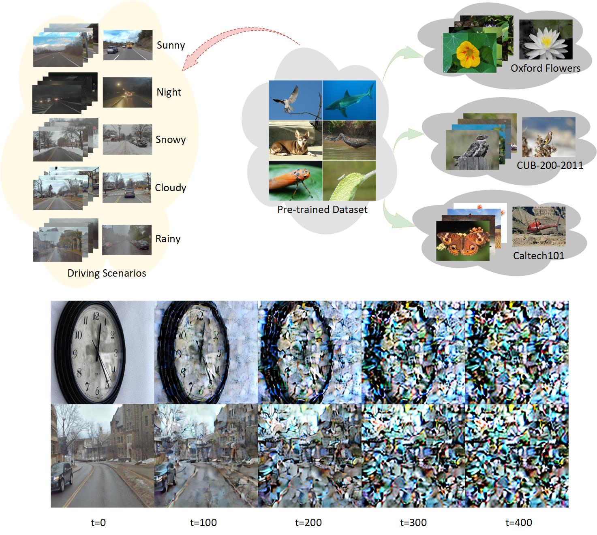
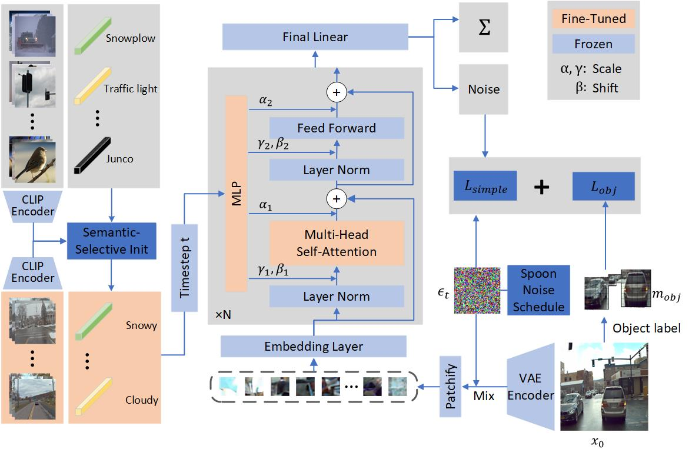
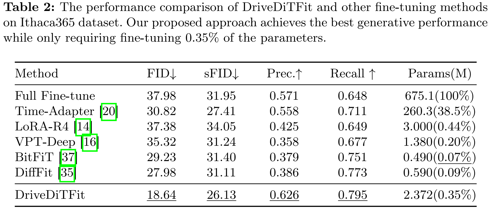
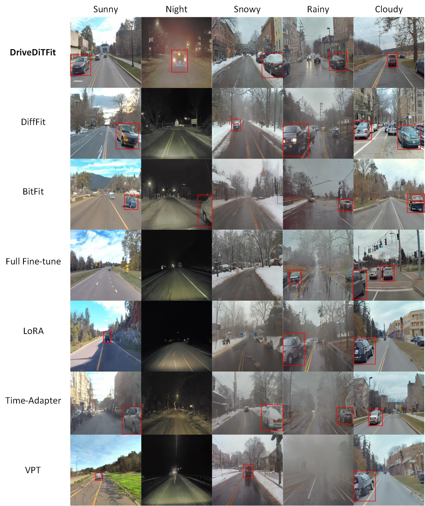

# DriveDiTFit: Fine-tuning Diffusion Transformers for Autonomous Driving Data Generation
[](https://arxiv.org/abs/2407.15661)


---

## Introduction
In autonomous driving, deep models have shown remarkable performance across various visual perception tasks with the demand of high-quality and huge-diversity training datasets. Such datasets are expected to cover various driving scenarios with adverse weather, lighting conditions and diverse moving objects. However, manually collecting these data presents huge challenges and expensive cost. With the rapid development of large generative models, we propose DriveDiTFit, a novel method for efficiently generating autonomous **Driv**ing data by **Fi**ne**T**uning pre-trained **Di**ffusion **T**ransformers (DiTs). Specifically, DriveDiTFit utilizes a gap-driven modulation technique to carefully select and efficiently fine-tune a few parameters in DiTs according to the discrepancy between the pre-trained source data and the target driving data. Additionally, DriveDiTFit develops an effective weather and lighting condition embedding module to ensure diversity in the generated data, which is initialized by a nearest-semantic-similarity initialization approach. Through progressive tuning scheme to refined the process of detail generation in early diffusion process and enlarging the weights corresponding to small objects in training loss, DriveDiTFit ensures high-quality generation of small moving objects in the generated data. Extensive experiments conducted on driving datasets confirm that our method could efficiently produce diverse real driving data.

## Discrpancy between Driving Scenarios and Classification Datasets.


## Method


## Results



## Requirements
### Environment
1. [torch 2.1.2](https://github.com/pytorch/pytorch)
2. [torchvision 0.16.2](https://github.com/pytorch/vision)
3. [timm 0.9.12](https://github.com/huggingface/pytorch-image-models)
4. cuda 12.2

### Datasets
We compare DriveDiTFit and other effecient fine-tuning methods on the [Ithaca365](https://ithaca365.mae.cornell.edu/) dataset and [BDD100K](https://doc.bdd100k.com/download.html) dataset. You can click the link below to download the corresponding dataset:

Ithaca365: [Link](http://en-ma-sdc.coecis.cornell.edu/web_data/Ithaca365-sub.zip), BDD100K: [Link](https://dl.cv.ethz.ch/bdd100k/data/100k_images_train.zip).

Note: Please download the dataset and unzip in ``./datasets``.

## Setup

We provide an [`requirements.txt`](environment.yml) file that can be used to create a Conda environment.

```bash
cd DriveDitFit
conda create -n env_name python=3.9
conda activate env_name
pip install -r requirements.txt
```


## Preprocessing
We provide scripts in ``./sh`` to resize the dataset to 256*256 and split dataset according to the weather and lighting labels. You should **modify the relevant variables** in the script according to the path of your dataset. Then, you can run the revelant scripts to modify the Ithaca365 dataset and BDD100K dataset respectively.
```bash
sh ./sh/ithaca_preprocessing.sh
sh ./sh/bdd_preprocessing.sh
```
In order to adopt object-sensitive loss, you can extract vehicles' bounding boxes in advance. We provide the folder organization for box information and offer the process on the Ithaca365 dataset as an example in ``./scripts/extract_boxes.ipynb``.

## Fine-Tuning
We provide a tuning script for DiT in [`train.py`](train.py). This script can be used to fine-tune [pre-trained DiT models](https://dl.fbaipublicfiles.com/DiT/models/DiT-XL-2-256x256.pt)with the DriveDitFit method for generating driving data. The pre-trained [VAE](https://huggingface.co/stabilityai/sd-vae-ft-ema) is frozen. We have provided the initialization results of scenario embeddings in **./pretrained_models** using Semantic-Selective Embedding Initialization method. You should specify the path of the driving dataset(--data-path), the path of bounding boxes(--boxes-path), the pre-trained model(--resume-checkpoint, --vae-checkpoint) in ``./sh/train.sh``.

```bash
CUDA_VISIBLE_DEVICES=0,1,2,3 torchrun --nnodes=1 --nproc_per_node=4 --master-port=11113 train.py --model DiT-XL/2
--data-path ./datasets/Ithaca365/Ithaca365-scenario --boxes-path ./datasets/box_info  \
--epochs 3000 --global-batch-size 16 --lr 1e-5 --log-every 50 --ckpt-every 100 \
--resume-checkpoint ./pretrained_models/DiT-XL-2-256x256.pt \
--vae-checkpoint ./pretrained_models/sd-vae-ft-ema \
--embed-checkpoint ./pretrained_models/clip_similarity_embed.pt \
--dataset_name ithaca365 --training_sample_steps 500 --scenario_num 5 --rank 2 --modulation \
--cond_mlp_modulation --rope --finetune_depth 28 --mask_rl 2 --noise_schedule progress
```


## Acknolegment

The implementation of Diffusion Transformer is based on [DiT](https://github.com/facebookresearch/DiT) and [DiffFit](https://github.com/mkshing/DiffFit-pytorch).


Many thanks to its contributors!

## Citation
If you find our work helpful for your research, please consider citing our work.
```bibtex
@article{tudriveditfit,
  title={DriveDiTFit: Fine-tuning Diffusion Transformers for Autonomous Driving Data Generation},
  author={Tu, Jiahang and Ji, Wei and Zhao, Hanbin and Zhang, Chao and Zimmermann, Roger and Qian, Hui},
  journal={ACM Transactions on Multimedia Computing, Communications and Applications},
  publisher={ACM New York, NY}
}
```